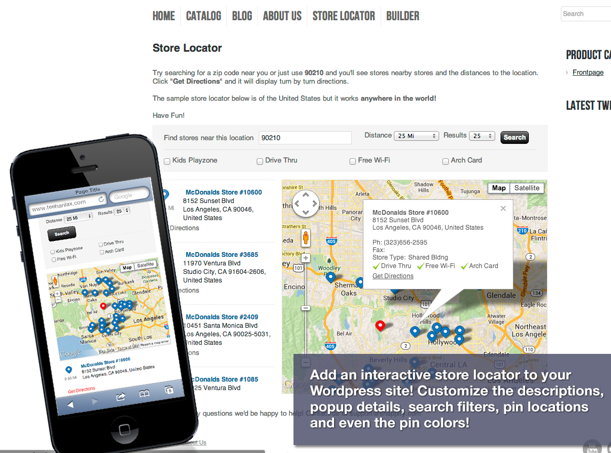
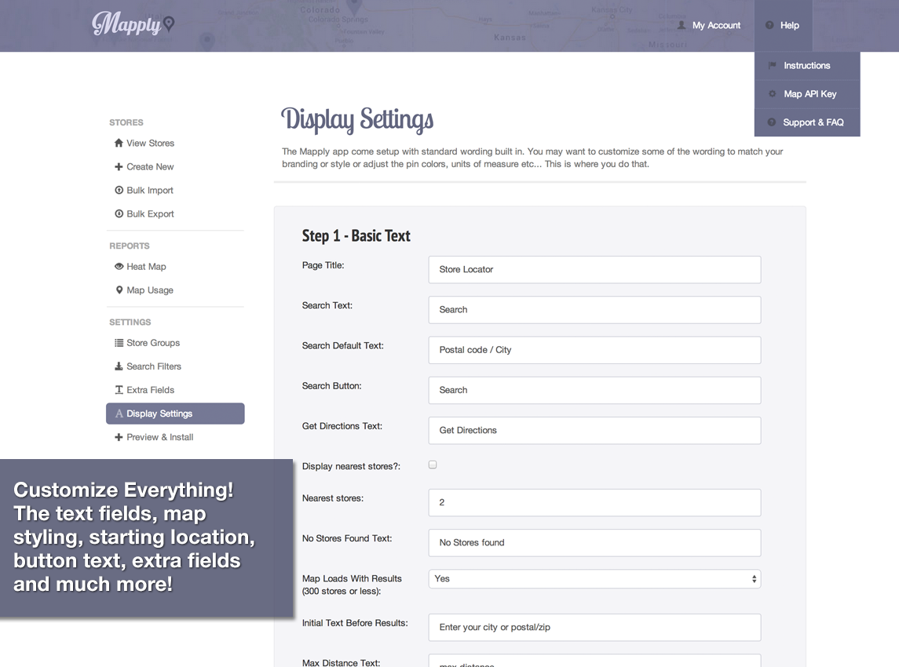

Mapply-WordPress-Plugin
=======================

A plugin that adds your mapply map to your WordPress website via shortcode. Sign up for your Mapply free trial on <a href="http://mapply.net">Mapply.net</a>. Once you have signed up you will need your API key and a Google Maps API key.

### Store Locator Software by Mapply

Mapply is a powerful and simple app that allows you to easily embed a Store Locator or Dealer Locator tool on your own website to help your customers find you! It is free to try for 30 days and can be setup in under 10 minutes by copying & pasting a single line of code!

Mapply is fully customizable - Customize the look and feel of your store locator with easy to use settings. Font & button colors, drop pin color, map size, original map location, and much more. You can even customize all of the descriptions and text to exactly what you want, or to any language!

### The Power of Google Maps 

This app uses the Google Maps API. Why? It just works better! It produces better search results, driving directions, uses the same search tool Google Maps does, supports simple search terms like city and street with misspellings and much more. Google is #1 map solution in the world for a reason!

### ★★★★★ FIVE STAR Customer Reviews 

★★★★★ "Tried them all and this is HANDS DOWN the best Store Locator app!! Works perfectly and looks great! If you have a Mapply account this is the easiest way to embed a store locator on your WordPress site, I've tried a few and this seems to be the best one by far.

I had to email them too to ask a question and their support was fast.

Two thumbs up!!"
- duskybipper

★★★★★ "The plug-in works like a CHARM!! These guys just keep creating amazing products/plug-ins!!

I received quick responses from the Support team and I haven't had that kind of service in quite sometime. Looking forward to some more releases in the future!! Keep up the great work all around!"
- solo62

★★★★★ "This plugin does what it says it will do. It just helps me get people in my door. The rest is on me! It was easy to install, even for an old guy who is not super good with computers, like me! If you have a physical store, you should get this plugin. It is good."
- SuperJames

### Here's just a few of the amazing features:

- Add Unlimited number of stores or dealer locations
- Drag and drop the pins to your exact location
- Create clickable search filters for your stores with options like "Open 24 Hours" - or "Wheelchair Accessible" and more!
- Create custom fields for each location. For example "Payment Methods Accepted" or "Special Instructions" and more!
- Built in real-time distance calculator. Drag your location to a new spot on the map and it will recalculate on the fly
- GET DIRECTIONS! Customers can get directions to any of your locations or dealers with one click!
- Search by address, zip or postal code, or just city
- Customize the look and feel of the Store Locator. Font colors, drop pin color, and html descriptions above or below it, change the units from KM to Miles and much more It's fully responsive and mobile friendly
- Customize all the titles, wording, button text, results text. Give it a feel that is consistent with your store's branding!
- Customize the layout and what's displayed for the address listings, and the popup bubbles
- Customize your map size, where geographically it starts, and from what zoom level!
- Add stores one at a time, or bulk import them using our wizard.

### New Features Just Added!

- Create customized groups for your stores or dealers to rank them or display them differently
- Mobile Friendly! Works on any device with no changes... It just works :-)
- Assign unique colors to the different groups so customers can easily see the different types of stores on the map
- Add expiration to stores or dealers if you want to feature them for a period of time
- Bulk Export all our stores in neat and tidy CSV file

### And Finally... the most power feature of all!

See a HEAT-MAP Report of where your customers are searching for you or your products! This will give you priceless information about where there is demand for your brand, product or store! This is a premium feature available on all paid plans.

[Click here to see a demo in a live store!][1]

  [1]: http://kunze-weimann7231.myshopify.com/apps/store-locator

Usage
------
In order to use the Mapply WordPress plugin you will need to save your Mapply API key (found in your Mapply settings).
You will need to save these keys in the settings page in your WordPress admin dashboard. Once saved you can use the [mapply] shortcode.

Shortcode:
<pre>
[mapply]
</pre>

Mapply will appear on your website wherever you have added the Shortcode.

Screenshots
-----------

Download
--------
Mapply is availble on the WordPress.org plugin directory right <a href="http://wordpress.org/plugins/mapply/">here</a>. You can download this plugin directly right <a href="https://github.com/BOLDInnovationGroup/Mapply-WordPress-Plugin/raw/master/mapply.zip">here</a>. You will need to unzip the main archive and grab mapply.zip to upload to your WordPress site through the plugin manager in the admin dashboard.

FAQ
---
<ul>
  <li><b>Q:</b>Where do I get a Mapply account?</li>
  <li><b>A:</b>You can sign up on <a href="http://mapply.net">Mapply.net</a></li>
</ul>
<ul>
  <li><b>Q:</b>Do I need the WordPress plugin to use Mapply with WordPress?</li>
  <li><b>A:</b>No, you can insert the JavaScript code directly into your website. The Shortcode is to make it easier for you.</li>
</ul>
<ul>
  <li><b>Q:</b>What is a Shortcode?</li>
  <li><b>A:</b><a href="http://codex.wordpress.org/Shortcode">Shortcodes</a> are macros supported by WordPress which make inserting code into your posts easier for you.</li>
</ul>
<ul>
  <li><b>Q:</b>Does the WordPress plugin cost anything?</li>
  <li><b>A:</b>This plugin is free with your Mapply subscription.</li>
</ul>
